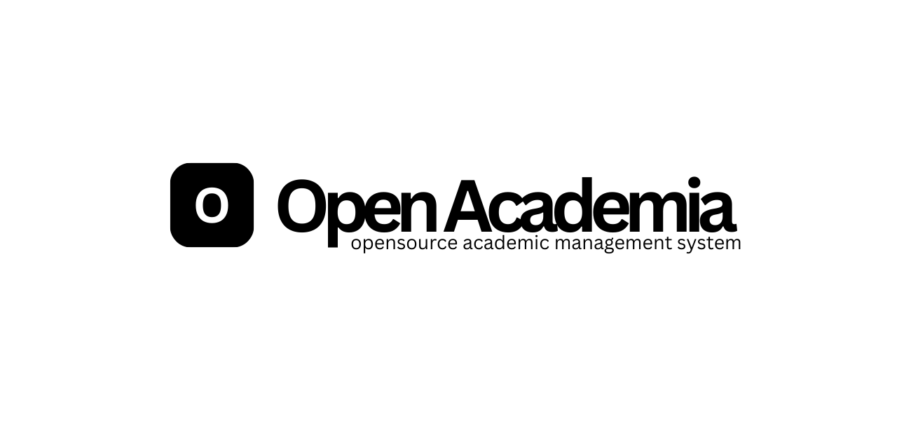

# OpenAcademia

OpenAcademia is an open-source academic management system designed for institutions that require full control over their academic infrastructure without dependency on proprietary vendors.

This project exists to address long-standing issues in campus information systems: opaque licensing, rigid contracts, limited extensibility, and platforms that prioritize vendor convenience over institutional autonomy.

(excalidraw)[https://excalidraw.com/#json=Fwhue34b_6ZAPU05Y2Lgo,6Ci_rOmeeb0w2Aez2J2Qew]

---

## Licensing

OpenAcademia is released under the GNU Affero General Public License (AGPLv3).

Any modification or deployment of this system over a network requires the modified source code to be made publicly available under the same license.

This ensures that improvements remain accessible to the academic community rather than being absorbed into closed commercial offerings.

---

## Contributions

Contributions are welcome.

All contributions must align with the project's core principles of transparency, maintainability, and institutional autonomy.

Please refer to `CONTRIBUTING.md` for guidelines.

---

## Disclaimer

OpenAcademia is provided as-is, without warranty.

Institutions adopting this system are expected to evaluate, deploy, and maintain it according to their own operational requirements.

---

OpenAcademia  
An open academic management system for institutions that prefer ownership over dependency.
